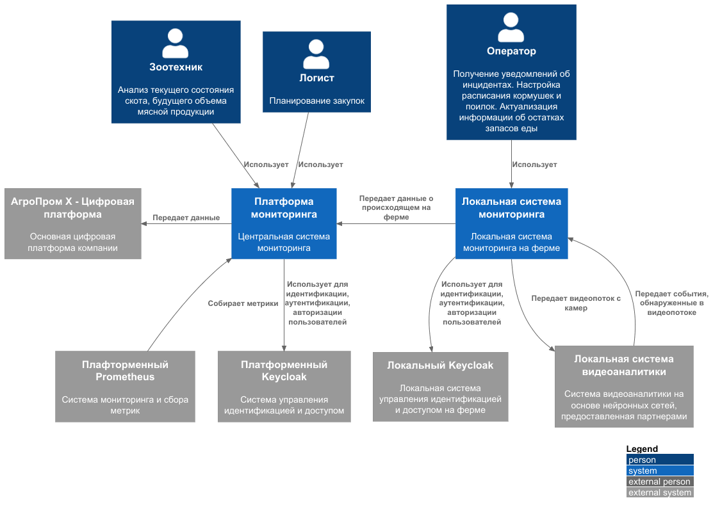

### **Название задачи:** Разработка вариантов решений
### **Автор:** Ренев Д.Ю.
### **Дата:** 15.07.2026

### **Функциональные требования**
| **№** | **Действующие лица или системы**                                                                                        | **Use Case**                                                | **Описание**                                                                                                                                                                                                                                                                                                                                                                                                                                                                                                                                                           |
|:-----:|:------------------------------------------------------------------------------------------------------------------------|:------------------------------------------------------------|:-----------------------------------------------------------------------------------------------------------------------------------------------------------------------------------------------------------------------------------------------------------------------------------------------------------------------------------------------------------------------------------------------------------------------------------------------------------------------------------------------------------------------------------------------------------------------|
|   1   | Пользователь, Локальная система мониторинга, Локальная система видеоаналитики                                           | Выявление беспокойного поведения и драк среди животных      | <ol><li>Система непрерывно анализирует поведение животных.</li><li>Система выявляет признаки беспокойного поведения или драки.</li><li>Система фиксирует событие.</li><li>Система определяет тип события и его местоположение.</li><li>Система формирует оповещение для оператора.</li><li>Система передаёт оператору информацию о событии.</li></ol>                                                                                                                                                                                                                  |
|   2   | Пользователь, Локальная система мониторинга, Локальная система видеоаналитики                                           | Выявление признаков задавливания поросят                    | <ol><li>Система непрерывно анализирует положение и поведение животных.</li><li>Система выявляет признаки, указывающие на возможное задавливание поросёнка.</li><li>Система фиксирует событие.</li><li>Система определяет место и время события.</li><li>Система формирует оповещение для оператора.</li><li>Система передаёт оператору информацию о выявленном событии.</li></ol>                                                                                                                                                                                      |
|   3   | Пользователь, Локальная система мониторинга                                                                             | Управление кормушками и поилками различных производителей   | <ol><li>Оператор настраивает режим работы кормушек и поилок в системе.</li><li>Система определяет производителя и тип оборудования.</li><li>Система устанавливает взаимодействие с выбранным оборудованием через соответствующий интерфейс.</li><li>Система передаёт команду выбранному устройству.</li><li>Устройство выполняет команду.</li><li>Система отображает оператору статус выполнения команды.</li></ol>                                                                                                                                                    |
|   4   | Пользователь, Локальная система мониторинга, Локальная система видеоаналитики                                           | Оценка состояния животных по внешнему виду и поведению      | <ol><li>Система непрерывно анализирует внешний вид и поведение животных.</li><li>Система выявляет отклонения от нормального состояния.</li><li>Система классифицирует выявленное состояние животного.</li><li>Система фиксирует результат оценки.</li><li>При выявлении критического или требующего внимания состояния система формирует оповещение для оператора.</li><li>Система передаёт оператору информацию о животном, выявленном состоянии и времени обнаружения.</li></ol>                                                                                     |
|   5   | Пользователь, Локальная система мониторинга, Платформа мониторинга                                                      | Мониторинг состояния систем фильтрации воды                 | <ol><li>Система получает и анализирует данные о работе оборудования.</li><li>Система сравнивает текущие параметры с допустимыми значениями.</li><li>Система выявляет отклонения, неисправности или необходимость обслуживания.</li><li>Система сохраняет информацию о состоянии системы фильтрации и выявленных отклонениях.</li></ol>                                                                                                                                                                                   |
|   6   | Пользователь, Локальная система мониторинга, Локальная система видеоаналитики                                           | Автоматический пересчёт поголовья животных                  | <ol><li>Система получает данные о животных в определенной зоне.</li><li>Система идентифицирует животных и подсчитывает их количество.</li><li>Система фиксирует результат пересчёта.</li><li>Система предоставляет оператору информацию о текущем количестве животных.</li></ol>                                                                                                                                                                                                                                                                                       |
|   7   | Пользователь, Локальная система мониторинга, Платформа мониторинга                                                      | Мониторинг запасов корма и прогнозирование его расхода      | <ol><li>Система получает данные о текущем объёме запасов корма.</li><li>Система анализирует историю и текущие показатели расхода.</li><li>Система рассчитывает прогнозируемый расход корма.</li><li>Система оценивает, на какой период хватит имеющихся запасов.</li><li>Система отображает текущие запасы, фактический расход и прогноз.</li></ol>                                                                                                                                                                                                                    |
|   8   | Локальная система мониторинга, Локальная система видеоаналитики                                                         | Поддержка видеокамер для аналитики в реальном времени       | <ol><li>Система обнаруживает подключённые камеры различных производителей.</li><li>Система устанавливает соединение с видеокамерами.</li><li>Система проверяет доступность и работоспособность камер.</li><li>Система получает видеопотоки от подключённых камер.</li><li>Система выполняет видеоаналитику в реальном времени.</li></ol>                                                                                                                                                                                                                               |
|   9   | Локальная система мониторинга, Платформа мониторинга, Платформенный Prometheus                                          | Предоставление базовых метрик для передачи в другие системы | <ol><li>Система собирает и обрабатывает данные из доступных источников.</li><li>Система рассчитывает или актуализирует базовые метрики.</li><li>Система формирует набор метрик в согласованном формате.</li><li>Система предоставляет метрики внешней системе через предусмотренный интерфейс интеграции.</li></ol>                                                                                                                                                                                                                                                    |
|  10   | Локальная система мониторинга, Платформа мониторинга, Платформенный Prometheus                                          | Добавление и использование собственных метрик               | <ol><li>Программно задается новая метрика.</li><li>Система проверяет корректность настройки метрики.</li><li>Система рассчитывает и предоставляет значение метрики.</li><li>При необходимости метрика становится доступной для отображения, анализа и передачи во внешние системы.</li></ol>                                                                                                                                                                                                                                                                           |
|  11   | Локальная система мониторинга, Платформа мониторинга, Локальный/Платформенный Keycloak                                  | Разграничение прав доступа на основе ролей                  | <ol><li>Пользователь инициирует вход в систему.</li><li>Система выполняет аутентификацию пользователя с использованием поддерживаемого способа.</li><li>Система определяет роли и права пользователя.</li><li>Система предоставляет пользователю доступ к разрешённым функциям и данным.</li><li>При попытке доступа к ограниченным ресурсам система проверяет наличие соответствующих прав.</li><li>Система разрешает или запрещает выполнение операции в соответствии с политикой доступа.</li><li>Система фиксирует события аутентификации и авторизации.</li></ol> |

### **Нефункциональные требования**
| **№** | **Требование**                                                                                                                                                                                                                                                                        |
|:-----:|:--------------------------------------------------------------------------------------------------------------------------------------------------------------------------------------------------------------------------------------------------------------------------------------|
|   1   | Система должна поддерживать подключение множества видеокамер для аналитики в реальном времени                                                                                                                                                                                         |
|   2   | Система должна поддерживать видеокамеры разных производителей                                                                                                                                                                                                                         |
|   3   | Система должна использовать архитектуру "центральный сервер - агенты"                                                                                                                                                                                                                 |
|   4   | Система должна поддерживать подключение произвольного количества агентов без заранее установленного верхнего ограничения                                                                                                                                                              |
|   5   | Задержка синхронизации между агентом и центральным сервером не должна превышать 10 минут, за исключением задержек, вызванных проблемами связи                                                                                                                                         |
|   6   | Система должна поддерживать современные способы аутентификации и авторизации                                                                                                                                                                                                          |
|   7   | Система должна работать даже в случае отсутствия интернета и при необходимости отправлять уведомления дежурному сотруднику на местах мониторинга, а после восстановления связи синхронизироваться с центральной системой                                                              |
|   8   | Система должна обеспечивать отказоустойчивость 99,95%                                                                                                                                                                                                                                 |
|   9   | Система должна обеспечивать возможность добавления новых функциональных модулей и компонентов без внесения изменений в существующие функциональные модули                                                                                                                             |
|  10   | Время от момента обнаружения нештатной ситуации системой видеоаналитики до момента оповещения оператора не должно превышать 5 секунд                                                                                                                                                  |
|  11   | Система видеоаналитики должна обеспечивать обработку входящих видеоданных и принятие решения о наличии заданного события в режиме, близком к реальному времени (миллисекунды)                                                                                                         |
|  12   | Система должна иметь API для создания мобильного приложения или веб-приложения                                                                                                                                                                                                        |                                  
                                                                                                                                                                       |
### **Решение**
Диаграмма контекста

Выбрана распределённая архитектура "центральная платформа - локальные системы мониторинга".

Центральная платформа отвечает за агрегацию данных со всех ферм, централизованный мониторинг, прогнозирование расхода кормов, интеграцию с корпоративными системами, работу с метриками.

Локальная система мониторинга развёртывается на каждой ферме и отвечает за критичные функции, не зависящие от интернета: 
подключение камер, получение видеопотоков, взаимодействие с локальной системой видеоаналитики, 
обработку инцидентов, оповещение оператора, управление кормушками и поилками.

Видеоаналитика выполняется локально, что позволяет обеспечить обработку данных в режиме, близком к реальному времени, и уложиться в требование по оповещению оператора не более чем за 5 секунд. 
При отсутствии связи локальная система продолжает работать автономно, сохраняет данные и синхронизирует их с центральной платформой после восстановления соединения.

Для аутентификации и авторизации используется Keycloak: локальный экземпляр обеспечивает автономную работу фермы, а платформенный - централизованный доступ. 
Для сбора метрик используется Prometheus.

Основной принцип выбора решения - размещать критичные к задержке и доступности интернета функции локально, а централизованные аналитические и интеграционные функции - на платформе.

### **Альтернативы**
Альтернативным решением может быть:
- Использование единой системы управления идентификацией и доступом и единой системы видеоаналитики (без разделения на платформенные и локальные системы) - не подходит 
из-за зависимости видеоаналитики, аутентификации и уведомлений от интернета, а также риска нарушения требований по задержке; 
так же при отсуствии интернета на ферме пользователь не сможет войти в систему.
- Разработка собственной системы управления идентификацией и доступом - не оптимально, т.к. в таком случае значительно повышается стоимость разработки системы относительно использования готового решения.
- Разработка собственной системы сбора и хранения метрик - не оптимально, т.к. в таком случае значительно повышается стоимость разработки системы относительно использования готового решения.

**Недостатки, ограничения, риски**

Основным недостатком решения является повышенная сложность распределённой архитектуры: 
необходимо управлять множеством локальных агентов, синхронизацией данных, версиями компонентов и удалёнными обновлениями.

Ключевые риски:
- Потеря или дублирование данных при синхронизации.
- Отказ локального оборудования.
- Ограниченность вычислительных ресурсов для видеоаналитики.
- Отказ Keycloak.
- Рост нагрузки на центральную платформу при увеличении числа агентов.
- Сложности обновления распределённых компонентов.
- Зависимость от внешних и платформенных решений.

Для снижения рисков предусматриваются резервирование, мониторинг, идемпотентная обработка данных, повторная передача сообщений, 
версионирование API, поэтапные обновления, возможность отката и изоляция внешних интеграций через адаптеры.