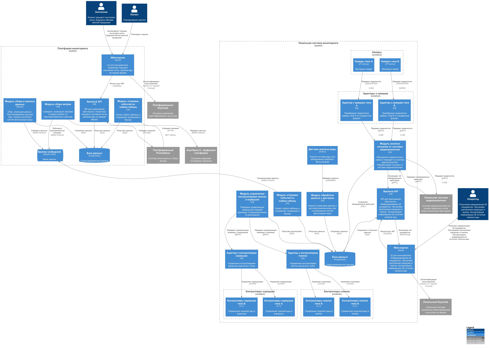

### **Название задачи:** Проработка критериев выбора решения
### **Автор:** Ренев Д.Ю.
### **Дата:** 20.07.2026

### **Функциональные требования**
| **№** | **Действующие лица или системы**                                                                                                                         | **Use Case**                                                | **Описание**                                                                                                                                                                                                                                                                                                                                                                                                                                                                                                                                                           |
|:-----:|:---------------------------------------------------------------------------------------------------------------------------------------------------------|:------------------------------------------------------------|:-----------------------------------------------------------------------------------------------------------------------------------------------------------------------------------------------------------------------------------------------------------------------------------------------------------------------------------------------------------------------------------------------------------------------------------------------------------------------------------------------------------------------------------------------------------------------|
|   1   | Пользователь, Адаптеры к камерам, Модуль анализа сигналов от системы видеоаналитики, Локальная система видеоаналитики, Backend API, Web-портал           | Выявление беспокойного поведения и драк среди животных      | <ol><li>Система непрерывно анализирует поведение животных.</li><li>Система выявляет признаки беспокойного поведения или драки.</li><li>Система фиксирует событие.</li><li>Система определяет тип события и его местоположение.</li><li>Система формирует оповещение для оператора.</li><li>Система передаёт оператору информацию о событии.</li></ol>                                                                                                                                                                                                                  |
|   2   | Пользователь, Адаптеры к камерам, Модуль анализа сигналов от системы видеоаналитики, Локальная система видеоаналитики, Backend API, Web-портал           | Выявление признаков задавливания поросят                    | <ol><li>Система непрерывно анализирует положение и поведение животных.</li><li>Система выявляет признаки, указывающие на возможное задавливание поросёнка.</li><li>Система фиксирует событие.</li><li>Система определяет место и время события.</li><li>Система формирует оповещение для оператора.</li><li>Система передаёт оператору информацию о выявленном событии.</li></ol>                                                                                                                                                                                      |
|   3   | Пользователь, Адаптер к контроллерам кормушек, Адаптер к контроллерам поилок, Модуль управления контроллерами поилок и кормушек, Backend API, Web-портал | Управление кормушками и поилками различных производителей   | <ol><li>Оператор настраивает режим работы кормушек и поилок в системе.</li><li>Система определяет производителя и тип оборудования.</li><li>Система устанавливает взаимодействие с выбранным оборудованием через соответствующий интерфейс.</li><li>Система передаёт команду выбранному устройству.</li><li>Устройство выполняет команду.</li><li>Система отображает оператору статус выполнения команды.</li></ol>                                                                                                                                                    |
|   4   | Пользователь, Адаптеры к камерам, Модуль анализа сигналов от системы видеоаналитики, Локальная система видеоаналитики, Backend API, Web-портал           | Оценка состояния животных по внешнему виду и поведению      | <ol><li>Система непрерывно анализирует внешний вид и поведение животных.</li><li>Система выявляет отклонения от нормального состояния.</li><li>Система классифицирует выявленное состояние животного.</li><li>Система фиксирует результат оценки.</li><li>При выявлении критического или требующего внимания состояния система формирует оповещение для оператора.</li><li>Система передаёт оператору информацию о животном, выявленном состоянии и времени обнаружения.</li></ol>                                                                                     |
|   5   | Пользователь, Модуль обработки данных с датчиков, Модуль отправки событий из outbox-таблиц, Модуль сбора и анализа данных, Backend API, Web-портал       | Мониторинг состояния систем фильтрации воды                 | <ol><li>Система получает и анализирует данные о работе оборудования.</li><li>Система сравнивает текущие параметры с допустимыми значениями.</li><li>Система выявляет отклонения, неисправности или необходимость обслуживания.</li><li>Система сохраняет информацию о состоянии системы фильтрации и выявленных отклонениях.</li></ol>                                                                                                                                                                                   |
|   6   | Пользователь, Адаптеры к камерам, Модуль анализа сигналов от системы видеоаналитики, Локальная система видеоаналитики, Backend API, Web-портал           | Автоматический пересчёт поголовья животных                  | <ol><li>Система получает данные о животных в определенной зоне.</li><li>Система идентифицирует животных и подсчитывает их количество.</li><li>Система фиксирует результат пересчёта.</li><li>Система предоставляет оператору информацию о текущем количестве животных.</li></ol>                                                                                                                                                                                                                                                                                       |
|   7   | Пользователь, Модуль отправки событий из outbox-таблиц, Модуль сбора и анализа данных, Backend API, Web-портал                                           | Мониторинг запасов корма и прогнозирование его расхода      | <ol><li>Система получает данные о текущем объёме запасов корма.</li><li>Система анализирует историю и текущие показатели расхода.</li><li>Система рассчитывает прогнозируемый расход корма.</li><li>Система оценивает, на какой период хватит имеющихся запасов.</li><li>Система отображает текущие запасы, фактический расход и прогноз.</li></ol>                                                                                                                                                                                                                    |
|   8   | Адаптеры к камерам, Модуль анализа сигналов от системы видеоаналитики, Локальная система видеоаналитики                                                  | Поддержка видеокамер для аналитики в реальном времени       | <ol><li>Система обнаруживает подключённые камеры различных производителей.</li><li>Система устанавливает соединение с видеокамерами.</li><li>Система проверяет доступность и работоспособность камер.</li><li>Система получает видеопотоки от подключённых камер.</li><li>Система выполняет видеоаналитику в реальном времени.</li></ol>                                                                                                                                                                                                                               |
|   9   | Модуль отправки событий из outbox-таблиц, Backend API, Платформенный Prometheus, Модуль сбора метрик                                                     | Предоставление базовых метрик для передачи в другие системы | <ol><li>Система собирает и обрабатывает данные из доступных источников.</li><li>Система рассчитывает или актуализирует базовые метрики.</li><li>Система формирует набор метрик в согласованном формате.</li><li>Система предоставляет метрики внешней системе через предусмотренный интерфейс интеграции.</li></ol>                                                                                                                                                                                                                                                    |
|  10   | Модуль отправки событий из outbox-таблиц, Backend API, Платформенный Prometheus, Модуль сбора метрик                                                     | Добавление и использование собственных метрик               | <ol><li>Программно задается новая метрика.</li><li>Система проверяет корректность настройки метрики.</li><li>Система рассчитывает и предоставляет значение метрики.</li><li>При необходимости метрика становится доступной для отображения, анализа и передачи во внешние системы.</li></ol>                                                                                                                                                                                                                                                                           |
|  11   | Пользователь, Локальный/Платформенный Keycloak, Web-портал, Backend API                                                                                  | Разграничение прав доступа на основе ролей                  | <ol><li>Пользователь инициирует вход в систему.</li><li>Система выполняет аутентификацию пользователя с использованием поддерживаемого способа.</li><li>Система определяет роли и права пользователя.</li><li>Система предоставляет пользователю доступ к разрешённым функциям и данным.</li><li>При попытке доступа к ограниченным ресурсам система проверяет наличие соответствующих прав.</li><li>Система разрешает или запрещает выполнение операции в соответствии с политикой доступа.</li><li>Система фиксирует события аутентификации и авторизации.</li></ol> |

### **Нефункциональные требования**
| **№** | **Требование**                                                                                                                                                                                                                                                                         |
|:-----:|:---------------------------------------------------------------------------------------------------------------------------------------------------------------------------------------------------------------------------------------------------------------------------------------|
|   1   | Система должна поддерживать подключение множества видеокамер для аналитики в реальном времени                                                                                                                                                                                          |
|   2   | Система должна поддерживать видеокамеры разных производителей                                                                                                                                                                                                                          |
|   3   | Система должна использовать архитектуру "центральный сервер - агенты"                                                                                                                                                                                                                  |
|   4   | Система должна поддерживать подключение произвольного количества агентов без заранее установленного верхнего ограничения                                                                                                                                                               |
|   5   | Задержка синхронизации между агентом и центральным сервером не должна превышать 10 минут, за исключением задержек, вызванных проблемами связи                                                                                                                                          |
|   6   | Система должна поддерживать современные способы аутентификации и авторизации                                                                                                                                                                                                           |
|   7   | Система должна работать даже в случае отсутствия интернета и при необходимости отправлять уведомления дежурному сотруднику на местах мониторинга, а после восстановления связи синхронизироваться с центральной системой                                                               |
|   8   | Система должна обеспечивать отказоустойчивость 99,95%                                                                                                                                                                                                                                  |
|   9   | Система должна обеспечивать возможность добавления новых функциональных модулей и компонентов без внесения изменений в существующие функциональные модули                                                                                                                              |
|  10   | Время от момента обнаружения нештатной ситуации системой видеоаналитики до момента оповещения оператора не должно превышать 5 секунд                                                                                                                                                   |
|  11   | Система видеоаналитики должна обеспечивать обработку входящих видеоданных и принятие решения о наличии заданного события в режиме, близком к реальному времени (миллисекунды)                                                                                                          |
|  12   | Система должна иметь API для создания мобильного приложения или веб-приложения                                                                                                                                                                                                         |

### **Решение**
Диаграмма контекста

Диаграмма контейнеров

Выбрана распределённая архитектура "центральная платформа - локальные системы мониторинга".

Центральная платформа отвечает за агрегацию данных со всех ферм, централизованный мониторинг, прогнозирование расхода кормов, интеграцию с корпоративными системами, работу с метриками.

Хранение метрик в Prometheus и реализация отдельного сервиса для сбора и публикации метрик обеспечивает возможность гибкой настройки метрик, в т.ч. добавления новых метрик.

Локальная система мониторинга развёртывается на каждой ферме и отвечает за критичные функции, не зависящие от интернета:
подключение камер, получение видеопотоков, взаимодействие с локальной системой видеоаналитики,
обработку инцидентов, оповещение оператора, управление кормушками и поилками.

Для интеграции с центральной платформой используется асинхронная передача данных через брокер сообщений Apache Kafka.
Данные, требующие гарантированной доставки, сначала сохраняются в локальной базе данных и передаются через outbox-механизм.
Это позволяет системе продолжать работу при временной недоступности центральной платформы и синхронизировать накопленные данные после восстановления связи.

Для интеграции оборудования разных производителей применяются отдельные адаптеры,
скрывающие различия конкретных протоколов и реализаций устройств от бизнес-логики системы.

Для видеоаналитики видеопотоки от различных камер приводятся к унифицированному формату и передаются в локальную систему видеоаналитики.
Результаты анализа обрабатываются локально, что позволяет обеспечить требуемую задержку формирования оповещения и независимость критичных функций от доступности Интернета.

Центральная и локальная части системы используют отдельные базы данных и собственные контуры аутентификации.
В качестве основного интерфейса взаимодействия с API используется GraphQL - это упрощает возможность создания мобильного приложения в будущем.
Уведомления о событиях в локальном контуре передаются оператору через WebSocket.

Основной принцип выбора решения - размещать критичные к задержке и доступности интернета функции локально, а централизованные аналитические и интеграционные функции - на платформе.

### **Альтернативы**

Альтернативным решением может быть:
- Использование единой системы управления идентификацией и доступом и единой системы видеоаналитики (без разделения на платформенные и локальные системы) - не подходит
из-за зависимости видеоаналитики, аутентификации и уведомлений от интернета, а также риска нарушения требований по задержке;
так же при отсуствии интернета на ферме пользователь не сможет войти в систему.
- Разработка собственной системы управления идентификацией и доступом - не оптимально, т.к. в таком случае значительно повышается стоимость разработки системы относительно использования готового решения.
- Разработка собственной системы сбора и хранения метрик - не оптимально, т.к. в таком случае значительно повышается стоимость разработки системы относительно использования готового решения.
- Использование интерфейса REST API вместо GraphQL для взаимодействия с API - не оптимально, т.к. в таком случае повысится стоимость реализации мобильного приложения в будущем.
- Использование RabbitMQ вместо Apache Kafka в качестве брокера сообщений - RabbitMQ хорошо подходит для очередей команд и событий, однако для выбранного сценария Kafka предпочтительнее
благодаря возможности длительного хранения сообщений, повторного чтения данных, масштабирования потоков данных и интеграции с потоковой обработкой; так же Kafka уже используется в контуре
компании, что упростит реализацию интеграций.
- Отправка данных для синхронизации между локальной системой и платформой напрямую, не используя outbox - практически гарантирована потеря событий при проблемах с интернетом.
- Упразднение сервисов адаптеров к каждому типу камер - в таком случае теряется возможность гибкого масштабирования сервисов под каждый тип камер,
что актуально, т.к. видеопотоков может быть много и это потенциально большие данные.

**Недостатки, ограничения, риски**

Основным недостатком решения является повышенная сложность распределённой архитектуры:
необходимо управлять множеством локальных агентов, синхронизацией данных, версиями компонентов и удалёнными обновлениями.

Ключевые риски:
- Потеря или дублирование данных при синхронизации.
- Отказ локального оборудования.
- Ограниченность вычислительных ресурсов для видеоаналитики.
- Отказ Keycloak.
- Рост нагрузки на центральную платформу при увеличении числа агентов.
- Сложности обновления распределённых компонентов.
- Зависимость от внешних и платформенных решений.

Для снижения рисков предусматриваются резервирование, мониторинг, идемпотентная обработка данных, повторная передача сообщений,
версионирование API, поэтапные обновления, возможность отката и изоляция внешних интеграций через адаптеры.

**Сравнение решений**

| **№** | **Критерий**                                       | **Основное решение**                                                                                                        | **Альтернативное решение**                                                                                            |
|:---:|:---------------------------------------------------|:----------------------------------------------------------------------------------------------------------------------------|:----------------------------------------------------------------------------------------------------------------------|
|  1  | **Надёжность и отказоустойчивость**                | ✅ Высокая. Outbox исключает потери, локальные контуры изолированы. Достижим SLA 99,95%.                                     | ⚠️ Пониженная. Прямая отправка без сохранения – риск потери данных при сбоях. Единая IAM – точка отказа.              |
|  2  | **Независимость от интернета**                     | ✅ Полная. Локальный Keycloak, видеоаналитика и управление работают без сети.                                                | ❌ Не обеспечена. Единая IAM требует доступности сети, аутентификация при отключении невозможна.                       |
|  3  | **Гарантированная доставка данных**                | ✅ Гарантирована. Outbox-паттерн + Kafka с длительным хранением и идемпотентностью.                                          | ❌ Не гарантирована. Отсутствие outbox и ограниченное хранение RabbitMQ – риск потери сообщений при разрывах.          |
|  4  | **Задержка оповещения и обработки видео**          | ✅ Минимальная. Локальная обработка, gRPC, WebSocket.                                                                        | ✅ Аналогично минимальная.                                                                                             |
|  5  | **Масштабируемость и расширяемость**               | ✅ Высокая. Независимые адаптеры под каждый тип камер, модульная архитектура, лёгкое добавление новых устройств.             | ⚠️ Ограниченная. Добавление камер требует модификации центрального модуля, усложнено масштабирование под разные типы. |
|  6  | **Сложность разработки и сопровождения**           | ❌ Выше. Множество компонентов, локальные инсталляции, распределённая синхронизация, управление версиями.                    | ✅ Ниже. Меньше сервисов, нет локальной IAM и сложного outbox.                                                         |
|  7  | **Безопасность и аутентификация**                  | ✅ Высокая. Раздельные контуры, локальная аутентификация при отказе связи, современные протоколы.                            | ⚠️ Уязвимость. Единая IAM – общая точка отказа. Компрометация влияет на все фермы.                                    |
|  8  | **Производительность и пропускная способность**    | ✅ Высокая. Kafka для больших потоков, gRPC для видео, адаптеры распределяют нагрузку.                                       | ⚠️ Средняя. RabbitMQ менее эффективен для потоковой обработки и длительного хранения больших объёмов.                 |
|  9  | **Готовность к будущим изменениям**                | ✅ GraphQL + WebSocket упрощают развитие клиентов (в т.ч. мобильных). Адаптеры изолируют вендорские детали.                  | ⚠️ Ограниченная. REST API замедляет мобильную разработку, изменения протоколов камер затрагивают ядро.                |
| 10  | **Инфраструктурные затраты**                       | ❌ Выше. Дополнительные ресурсы под локальный Keycloak, адаптеры, outbox-сервисы.                                            | ✅ Ниже. Меньше компонентов и вычислительных мощностей.                                                                |

**Резюме**

Несмотря на более высокую сложность и инфраструктурные затраты, основное решение полностью удовлетворяет всем критическим нефункциональным требованиям:
- Обеспечивает автономную работу фермы при отсутствии интернета (локальный Keycloak, локальная видеоаналитика, локальное управление оборудованием).
- Гарантирует надёжную доставку данных с помощью outbox-паттерна и Apache Kafka.
- Предоставляет гибкую масштабируемость видеоаналитики через отдельные адаптеры камер.
- Закладывает удобную основу для будущего развития, включая мобильные приложения (GraphQL, WebSocket).

Альтернативный вариант создаёт неприемлемые риски потери данных и недоступности системы в условиях нестабильного интернет-соединения, 
что прямо противоречит эксплуатационным требованиям к платформе мониторинга скота. Дополнительные затраты основного варианта 
являются оправданными инвестициями в отказоустойчивость и независимость критических функций.